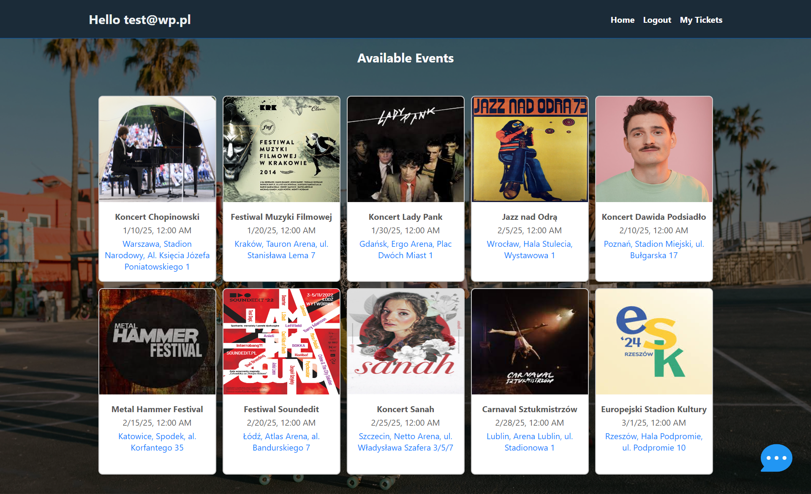
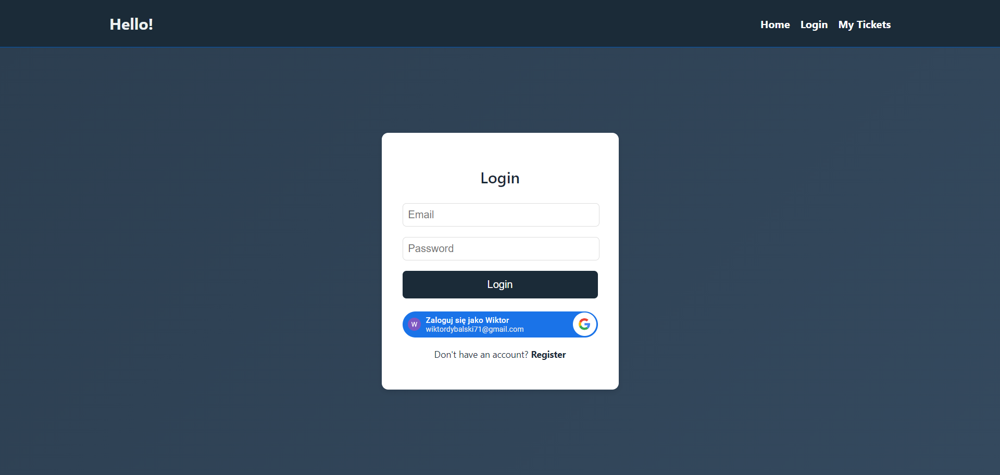
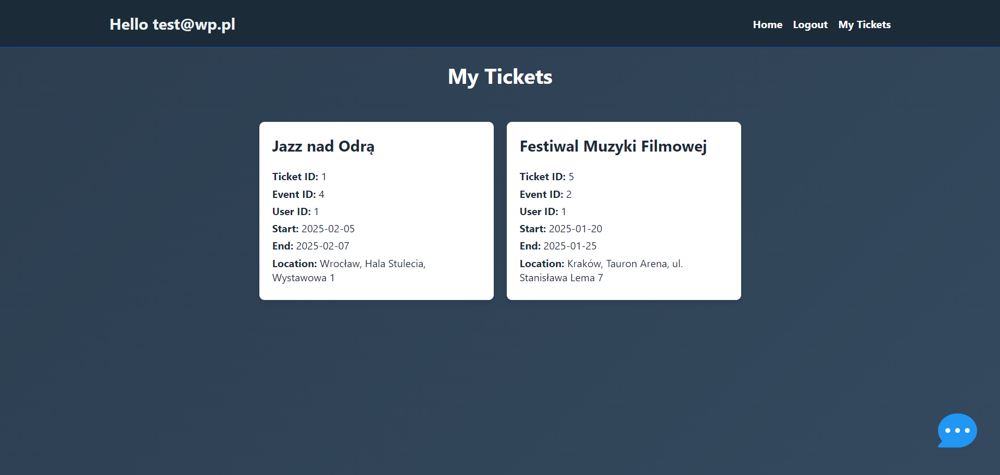
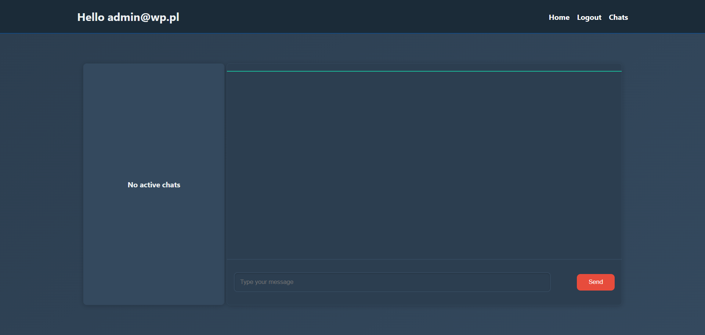
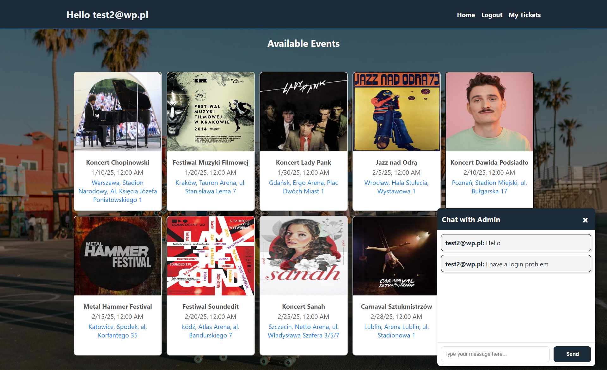
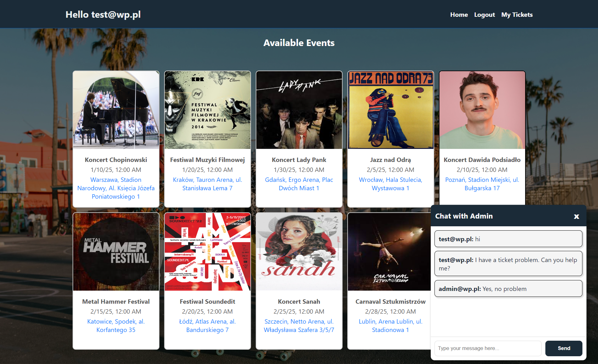
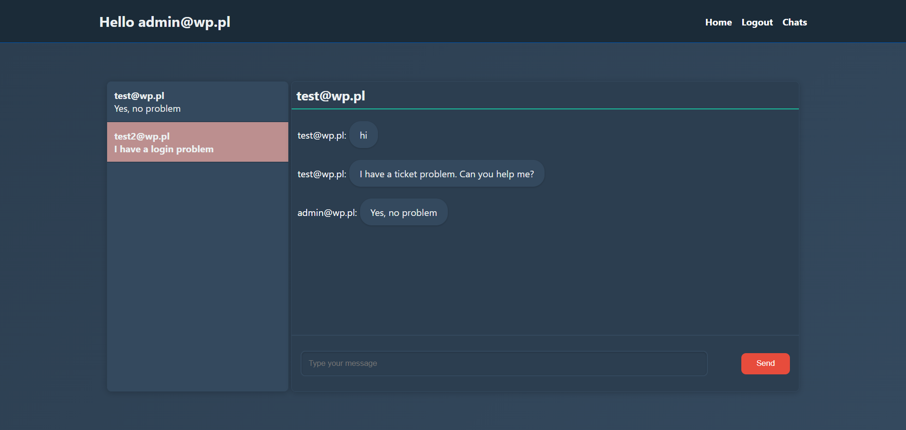

## TicketTrail

### Description

TicketTrail is an event management system that provides features for booking, and managing event tickets. This project uses Spring Boot for the backend and Angular for the frontend. Key functionalities include:

 - Event Booking: Browse and book tickets for various events.
 - JWT Authentication: Secure user sessions with JSON Web Tokens.
 - Google OAuth2: Log in using Google accounts.
 - SMS Notifications: Receive SMS updates about events via Twilio.
 - Google Maps Integration: Access event locations with Google
 Maps.
 - Real-Time Chat: Communicate with the site administrator using WebSockets.

### Project Screenshots

1. Home Page


2. Login Page


3. My Tickets Page


4. Empty Admin Chat


5. User1 interaction


6. User2 interaction


7. Admin Chat


### Usage

##### Database:
```bash
   - docker-compose up -d
```

##### Backend:
```bash
    - cd server
    - mvn spring-boot:run
```

##### Frontend:
```bash
    - cd client
    - ng serve
```

### Author
 - Wiktor Dybalski
